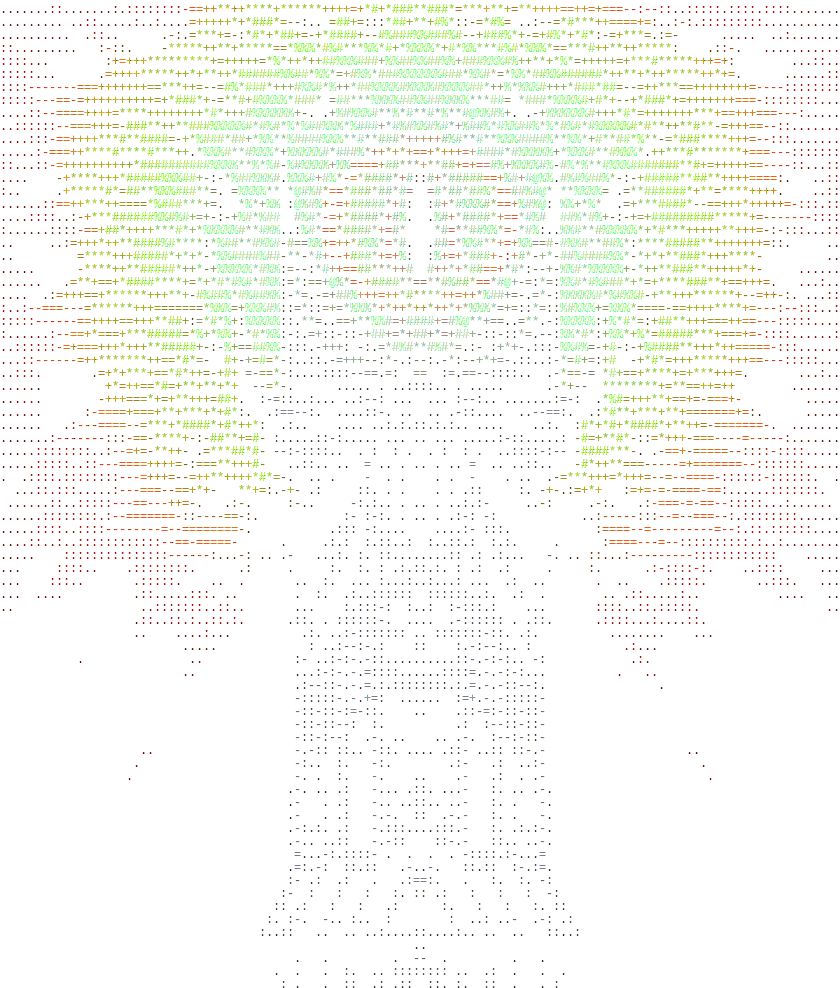

# Barad-dûr

<p align="center">
    

A project-agnostic file watcher that runs your check pipeline on every save and
surfaces failures before CI does.

```
━━━ #1 14:32:08 ━━━━━━━━━━━━━━━━━━━━━━━━━━━━━━━━━━━━━━━━━━━━━━━━━━
▸ format    ✓                                                   0.2s
▸ compile   ✓                                                   1.1s
▸ credo     ✗   3 issues                                        1.8s
▸ test      ✓                                                   2.3s

1 failed · 3 passed · 5.4s
```

The divider turns green when all steps pass and red when any fail. On file-change
restarts it also shows which file triggered the run:

```
━━━ #2 14:33:01  ·  lib/foo.ex ━━━━━━━━━━━━━━━━━━━━━━━━━━━━━━━━━━━
```

After the run completes, baraddur enters browse mode — navigate the step list
and expand output inline:

```
▸ format    ✓                                                   0.2s
▸ compile   ✓                                                   1.1s
▶ credo     ✗   3 issues                                        1.8s
  lib/foo.ex:42:3 [C] Modules should have a @moduledoc tag.
  lib/foo.ex:58:5 [R] Function is too complex (cyclomatic: 11).
  lib/bar.ex:17:1 [D] TODO comment found.
▸ test      ✓                                                   2.3s

  j/k ↑/↓  navigate · Enter/o  toggle output · O  expand all · q  quit
```

## Install

```bash
just install
# or manually:
cargo build --release && cp ./target/release/baraddur ~/.local/bin/baraddur
```

## Quick start

Create a `.baraddur.toml` in your project root and run `baraddur` from anywhere
inside that project. See [Config examples](#examples) below for common stacks.

baraddur runs the pipeline immediately on launch, then re-runs it on every file
change. Steps are killed and restarted if a file changes mid-run.

## Browse mode

After each run, baraddur enters an interactive browse mode:

| Key | Action |
|---|---|
| `j` / `↓` | move cursor down |
| `k` / `↑` | move cursor up |
| `gg` | jump to first step |
| `G` | jump to last step |
| `Enter` / `o` | toggle output for selected step |
| `O` | expand all / collapse all |
| `q` | quit baraddur |

Failing steps start with their output expanded. Save a file to exit browse mode
and rerun the pipeline immediately.

## Config

Config is discovered by walking up from the current directory (like `.gitignore`).
A global fallback lives at `~/.config/baraddur/config.toml`.

### Full schema

```toml
[watch]
extensions = ["ex", "exs", "heex"]  # file extensions to watch
debounce_ms = 1000                  # wait this long after the last event before running
ignore = ["_build", "deps", ".git", ".baraddur"] # names match any path component; paths with / match by prefix

[output]
clear_screen = true   # clear the terminal between runs
show_passing = false  # hide stdout/stderr from passing steps

[summarize]
enabled = false  # opt-in LLM failure summaries (not yet implemented)

[[steps]]
name = "format"
cmd  = "mix format --check-formatted"
parallel = false  # must pass before continuing

[[steps]]
name = "credo"
cmd  = "mix credo"
parallel = true   # runs concurrently with other parallel steps

[[steps]]
name = "test"
cmd  = "mix test --failed"
parallel = true
```

### Examples

<details>
<summary>Rust / Cargo</summary>

```toml
[watch]
extensions = ["rs"]
debounce_ms = 500
ignore = ["target", ".git"]

[[steps]]
name = "check"
cmd = "cargo check"
parallel = false

[[steps]]
name = "test"
cmd = "cargo test"
parallel = false
```

</details>

<details>
<summary>TypeScript / Node.js</summary>

```toml
[watch]
extensions = ["ts", "tsx"]
debounce_ms = 500
ignore = ["node_modules", "dist", ".baraddur"]

[output]
clear_screen = true
show_passing = false

[[steps]]
name = "lint"
cmd = "npx biome check ."
parallel = true

[[steps]]
name = "type-check"
cmd = "npx tsc --noEmit"
parallel = true

[[steps]]
name = "unused-exports"
cmd = "npx knip"
parallel = true
```

All three steps run concurrently as a single stage. Swap in `eslint`, `prettier`,
or any other tool you prefer.

</details>

<details>
<summary>Elixir / Mix</summary>

```toml
[watch]
extensions = ["ex", "exs", "heex"]
debounce_ms = 500
ignore = ["_build", "deps", ".git", ".expert"]

[[steps]]
name = "format"
cmd = "mix format --check-formatted"
parallel = false

[[steps]]
name = "compile"
cmd = "mix compile --warnings-as-errors"
parallel = false

[[steps]]
name = "credo"
cmd = "mix credo"
parallel = true

[[steps]]
name = "test"
cmd = "mix test --failed"
parallel = true
```

</details>

### Parallel steps

Consecutive `parallel = true` steps run as a batch — all start at once, all
must complete before the next stage begins. `parallel = false` steps always run
alone and gate everything after them.

```
stage 1: [format]         # parallel=false — must pass
stage 2: [compile]        # parallel=false — must pass
stage 3: [credo, test]    # parallel=true  — run concurrently
```

If any stage fails, subsequent stages are skipped.

### Command parsing

`cmd` strings are split with POSIX shell-word rules (`shell-words` crate). Shell
features like pipes, `&&`, and glob expansion are not supported. For those, use
`sh -c`:

```toml
cmd = "sh -c 'mix compile 2>&1 | head -50'"
```

## CLI flags

```
baraddur [OPTIONS]

Options:
  -c, --config <FILE>     Config file (disables walk-up discovery)
  -w, --watch-dir <DIR>   Directory to watch [default: config file's directory]
      --no-tty            Force plain append-only output
      --no-clear          Don't clear the screen between runs
  -v, --verbose           Show output from passing steps (-vv for debug events)
  -q, --quiet             Only show failures
  -h, --help
  -V, --version
```

### Verbosity

| Flag | Behavior |
|---|---|
| `-q` | Silence everything except failures |
| *(default)* | Step list with pass/fail glyphs; expand output in browse mode |
| `-v` | Also stream stdout/stderr from passing steps (non-TTY/piped mode only) |
| `-vv` | Also print internal debug events to stderr |

### Output modes

In a terminal, baraddur redraws the step block in place with colors, a braille
spinner, and interactive browse mode after each run. When stdout is not a
terminal (piped, CI), it falls back to plain append-only lines with timestamps:

```
[14:32:08] run #1 started
[14:32:08] ▸ format running
[14:32:08] ▸ format  ✓  (0.2s)
[14:32:09] ▸ compile  ✓  (1.1s)
[14:32:11] ▸ credo  ✗  (1.8s)
--- credo output ---
  lib/foo.ex:42:3 [C] Modules should have a @moduledoc tag.
[14:32:11] run complete: 1 failed, 3 passed, 5.4s
```

Force plain mode with `--no-tty`. Disable colors without touching TTY detection
by setting `NO_COLOR=1`.

## Output log

After each run, full step output is written to `.baraddur/last-run.log` relative
to the watch root. Add it to your `.gitignore`:

```
.baraddur/
```

On screen, output longer than 50 lines is truncated to the first 25 and last 25
lines with an elision marker pointing to the log file.

## Project status

| Phase | Status |
|---|---|
| Core watcher + sequential pipeline | ✓ done |
| Config discovery, validation, error polish | ✓ done |
| Parallel execution, mid-run cancel+restart | ✓ done |
| Terminal polish (colors, spinner, verbosity) | ✓ done |
| Browse mode (interactive post-run navigation) | ✓ done |
| LLM failure summaries | planned |
| Distribution (CI, release binaries, install script) | planned |
